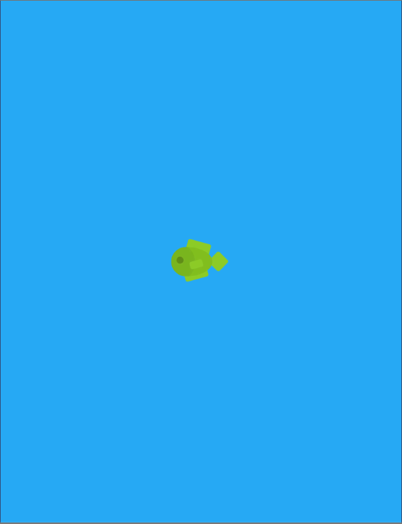

extends: default.liquid

title: Fish game started
date: 08 Mar 2017 12:00:30 +0000
description: We're creating a new game about fishing, heavily inspired by Stardew Valley.
slug: start-of-development
---

# Fish game devlog

When playing [Stardew Valley](http://stardewvalley.net/) last year, we really enjoyed the fishing mini-game, so decided to make our own version which can also be played on a phone. The fishing game will be pretty similar to Stardew Valley's version: you will move a bar up and down the screen based on clicks or taps to try to keep the bar over a fish. While the bar is over the fish, a progress meter fills up, and when the bar is not over the fish, the meter empties. If the meter fills entirely you've caught the fish, and if it empties then the fish has escaped and you lose.

To keep things interesting, you won't know the type of fish until it's been caught; instead, a generic fish icon will be used, although the speed and frequency of movement will change depending on the type of fish. There will also be collectables in the fishing screen which appear away from the fish, so you have a choice between carrying on catching the fish or risking it get away by going for the collectable. Both these elements are present in the Stardew Valley version, and are both things I really enjoyed.

## Tools

We're going to use [Unity](https://unity3d.com) to make this game - although we haven't used Unity before, there are a lot of tutorials and a large community around it which should make it relatively straightforward to learn how to use, and also offers export to phone apps. With our other games, we used Javascript so have had to use wrappers like [Cordova](https://cordova.apache.org/) or [Electron](https://electron.atom.io/) to get non-web versions of the game. Using Unity means we can have one codebase which can export to multiple platforms with a click of a button. Joy!

## Progress pics

Quick prototype: we dragged a sprite into Unity and it rendered, so here it is!

